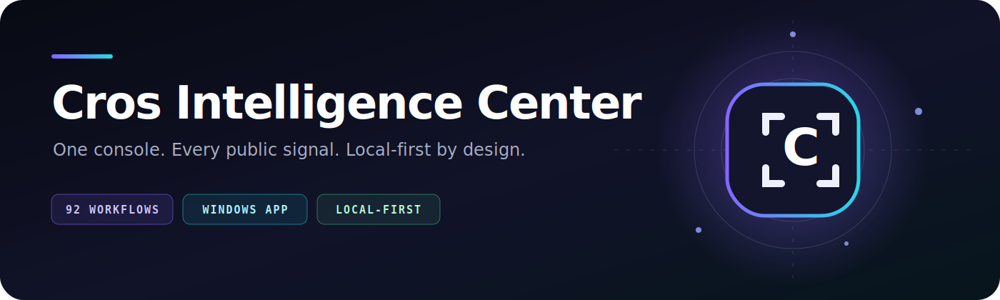

<div align="center">
  

  <p><strong>A polished, local-first OSINT and defensive Windows workspace.</strong></p>

  <p>
    
    
    
    
    
  </p>

  <p>
    <a href="#quick-install">Install</a> ·
    <a href="#what-you-get">Features</a> ·
    <a href="docs/QUICKSTART.md">Tutorial</a> ·
    <a href="docs/USER_GUIDE.md">User guide</a> ·
    <a href="docs/SECURITY_GUIDE.md">Security guide</a>
  </p>
</div>

---

## What is Cros?

Cros turns public-source research, local analysis, and defensive Windows checks into one focused desktop experience. It opens as an app window, keeps prompts and results inside the interface, and stores your workspace on your own computer.

It is built for legitimate research on information and systems you own or are authorized to examine. Public results are leads—not proof—and should always be verified.

## What you get

| | Capability | What it does |
|---|---|---|
| 🔎 | **Public account research** | Runs Blackbird, Sherlock, Maigret, and Cros Quick checks with formatted in-app results. |
| 🧭 | **Investigation workspace** | Pins tools, keeps durable notes, maps entities, and saves research context locally. |
| 🖼️ | **Local image analysis** | Reviews metadata, embedded GPS, hashes, and face regions without identifying people. |
| 🛡️ | **Windows defense** | Provides RAT heuristics, Defender integration, persistence checks, hardening reviews, and recovery guidance. |
| 🧪 | **File and indicator analysis** | Hashes files, normalizes indicators, inspects archives, and presents reputation-provider pivots. |
| 🎨 | **Personalization** | Includes ten themes, responsive screen layouts, custom colors, compact cards, and selectable app logos. |
| 📚 | **Learning center** | Includes a lesson and source guidance for every workflow. |
| 🔐 | **Local-first defaults** | Binds to `127.0.0.1`, generates a session token at launch, and excludes local state from Git. |

## Quick install

### Requirements

- Windows 10 or 11
- PowerShell
- Internet access for Git, Python dependencies, and public research providers

Open **PowerShell** and paste:

```powershell
irm https://raw.githubusercontent.com/cros20471/cros-intelligence-console/main/install_cros.ps1 | iex
```

The installer downloads Cros to your Documents folder, installs the required Python packages and account-search engines, creates the local app shortcut, and starts Cros.

> Prefer to inspect scripts before running them? Open [`install_cros.ps1`](install_cros.ps1), review it, then download or clone the repository manually.

## Update

Close Cros, open PowerShell, and paste:

```powershell
$u=Get-ChildItem ([Environment]::GetFolderPath('MyDocuments')),$HOME -Filter update_cros.ps1 -File -Recurse -ErrorAction SilentlyContinue | Select-Object -First 1; if(!$u){throw 'Cros was not found'}; powershell -NoProfile -ExecutionPolicy Bypass -File $u.FullName
```

Updates preserve local notes, pins, map data, appearance settings, and the operator name.

## Uninstall

The uninstaller asks you to type `DELETE` before removing anything:

```powershell
$u=Get-ChildItem ([Environment]::GetFolderPath('MyDocuments')),$HOME -Filter uninstall_cros.ps1 -File -Recurse -ErrorAction SilentlyContinue | Select-Object -First 1; if(!$u){throw 'Cros was not found'}; powershell -NoProfile -ExecutionPolicy Bypass -File $u.FullName
```

Add `-KeepLocalData` to the final PowerShell invocation if you want a desktop backup of local preferences and workspace data.

## Start exploring

1. Open **Tool Index** and choose a workflow.
2. Select **Learn** for its safe-use guide or **Launch Tool** to run it.
3. Pin useful workflows to the Investigation Workspace.
4. Add only the minimum notes needed for your case.
5. Verify public-source results before treating separate pages as the same identity.

The complete walkthrough is in the **[Quick Start Tutorial](docs/QUICKSTART.md)**.

## Privacy and OPSEC

- Cros does not require a hosted account.
- The app server listens only on `127.0.0.1`.
- Local notes, maps, preferences, reports, cases, exports, keys, and generated icons are ignored by Git.
- Image analysis uses a temporary local copy and removes it after processing.
- Third-party provider buttons explain when opening a provider sends a query or hash.
- API credentials stored through Cros use Windows local protection and are never part of the repository.

Before sharing a fork, inspect `git status`, run the built-in Secret Scanner, and rotate any credential that was ever committed. Deleting it from the newest commit does not erase Git history.

## Project layout

```text
cros-intelligence-console/
├─ web/                 App interface, logo, manifest, and styles
├─ docs/                Tutorials, user guide, and security guide
├─ tests/               Regression tests
├─ app_server.py        Local desktop app server and native workflows
├─ app_catalog.py       92-tool catalog
├─ learning_catalog.py  Lessons and source references
├─ osint_tool.py        Local/public-source workflow implementations
├─ security_tools.py    Defensive Windows workflow implementations
├─ install_cros.ps1     First-time installer
├─ update_cros.ps1      Safe updater
└─ uninstall_cros.ps1   Guarded remover
```

Runtime engine folders, reports, local state, and generated dependencies are intentionally absent from GitHub.

## Documentation

- **[Quick Start Tutorial](docs/QUICKSTART.md)** — install Cros and run a first workflow.
- **[User Guide](docs/USER_GUIDE.md)** — workspace, tools, maps, and research behavior.
- **[Security Guide](docs/SECURITY_GUIDE.md)** — defensive checks, limitations, and interpretation.

## Development

```powershell
python -m pip install -r requirements.txt
python -m unittest -v tests/test_upgrade.py
python app_server.py
```

Keep changes local-first, avoid hidden uploads, preserve source attribution, and add tests for new user-facing workflows.

## License

Released under the [MIT License](LICENSE).
